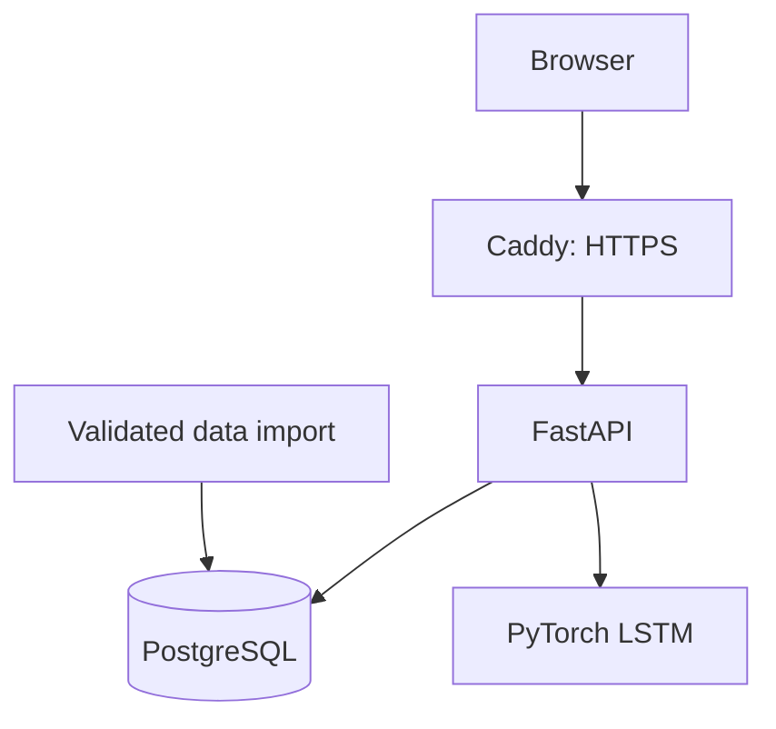

# Function Optimization Game
### Interactive replay of human decisions with LSTM predictions

How do people search for the best solution when they have limited time,
limited information, and competitors?

This application replays decisions from a behavioral experiment in which
participants sampled locations on an unknown mathematical landscape to
find a high-value point. Visitors can follow a participant's search,
reveal the underlying landscape, and compare recorded behavior with
predictions from a trained LSTM neural network.

**[Explore the live demo](https://function-optimization.duckdns.org)**

The AWS instance may be paused to conserve hosting credits.
The demo is unavailable while it is paused.

## Try the demo

1. Select a session, game, participant, and round.
2. Advance through the participant's recorded samples.
3. Reveal the landscape to see where better solutions were available.
4. Inspect the model's next-sample predictions and stop/continue classification.

Positions and observed values are normalized by default so that rounds
with different search ranges and objective functions are easier to compare.
Original units are also available.

## What I built

I extended my experimental modeling work into a deployed application:

- Imported CSV and Excel records into PostgreSQL with checks that prevent
  duplicate imports and reject conflicting records.
- Rebuilt the model's 14 input features from database history at request time.
- Connected five trained PyTorch LSTM fold models to a FastAPI service.
- Built an interactive historical replay interface.
- Containerized the API and PostgreSQL with Docker Compose.
- Added GitHub Actions checks that build the application and exercise the
  API against synthetic PostgreSQL records.
- Deployed the application on AWS EC2 with Caddy-managed HTTPS.
- Configured automatic container restart and dynamic DNS updates, then
  verified recovery after stopping and restarting EC2.

## Architecture

FastAPI reconstructs the selected history from PostgreSQL and sends
the resulting features to the assigned held-out model. Runtime inference
does not read the original preprocessed sequence cache.

The API and database run in Docker containers on one EC2 instance.
Caddy forwards public HTTPS requests to the locally bound API.
PostgreSQL has no published host port.

## Data and predictions

The imported dataset contains **1,093 nonempty participant-round records**
from three experimental sessions and four game conditions.
**1,086 sequences** have assignments to the original five model folds;
seven one-sample rounds remain available for replay but lack model assignments.

The conditions vary information sharing and access to opponent information.
Objective functions and search ranges differ across sessions, and function
parameters vary across rounds.

At a selected step, the model predicts:

- The next sampled position.
- The next observed value.
- A stopping probability, converted into a stop/continue classification
  using the original game-specific thresholds.

These are predictions of recorded behavior, not recommendations for an
optimal decision.

## Validation

| Check | Result |
|---|---|
| Full SQL feature and model-output comparison with the original reference | Matched across all 1,086 model sequences; maximum model-output difference 0 |
| Request-time SQL prefix verification on AWS | 36 prefixes across 12 session/game combinations; maximum prediction difference 0 |
| Next-position MAE after at least four own samples | 10.40 percentage points of the normalized search range |
| Container/API CI | Passed using synthetic PostgreSQL records |
| EC2 stop/start recovery | Containers restarted, DNS updated, and HTTPS health check succeeded |

Reproducing saved predictions verifies implementation consistency.
It does not provide a new, independent estimate of model accuracy.

## Interpretation and limitations

- **Historical replay:** inference uses each sequence's original held-out
  fold assignment. This is not a general prediction service for arbitrary
  new participants, and it does not establish performance on unseen people.
- **Stopping behavior:** a sequence can end through submission or timeout.
  The stop prediction does not distinguish voluntary stopping from a
  deadline ending the round.
- **Threshold selection:** stop/continue thresholds were selected by
  maximizing F1 on validation predictions. Performance measured on those
  same predictions is not an independent test result.
- **Analyst perspective:** quality normalization uses the estimated maximum
  of the full objective function, which participants may not have known.
- **Time reference:** the replay shows time since the participant's first
  recorded sample, not time since the round began.
- **Shared information:** the graph shows the participant's own samples.
  Model inputs also incorporate the applicable historical context.
- **Preserved preprocessing:** the implementation retains the original
  opponent-context availability rule, which depends on whether the stored
  opponent timeline is nonempty.
- **Fixed dataset:** no new experimental observations arrive. Infrastructure
  health checks do not constitute ongoing model-quality or drift monitoring.
- **Private artifacts:** raw research data, trained models, and credentials
  are not included in this repository.

The sigmoid stopping output has not been established as a calibrated
probability. Predicted position and value are separate outputs and need
not lie exactly on the objective curve.

## Running and deployment

See [deployment instructions](deploy/README.md) for architecture,
private prerequisites, validation, troubleshooting, and pause/resume.

A full local deployment requires authorized data and model artifacts.
GitHub Actions uses synthetic records to check the container and API
without those private artifacts.

The [v0.5 SQL migration note](docs/sql-inference-migration-v0.5.md)
is retained for implementation history. Its upgrade instructions describe
an earlier development stage and are not the current setup guide.