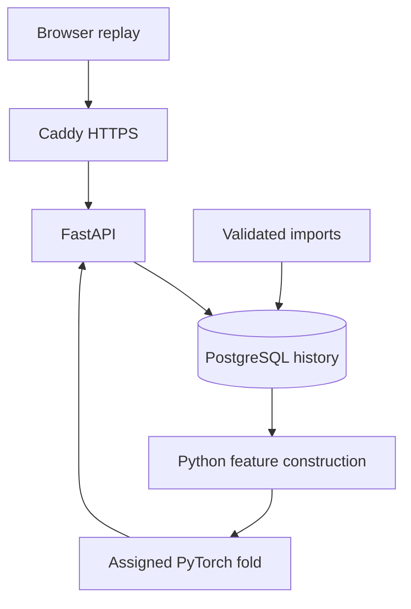

# Decision Lab: product testing under competition

**by Kaan Mutlu**

In product development, testing costs resources while competitors keep searching. Decision Lab turns a controlled experiment about that trade-off into an interactive, deployed machine-learning application.

[Explore the live demo](https://function-optimization.duckdns.org) · [Technical guide](docs/ENGINEERING_GUIDE.md) · [File-by-file and line-by-line guide](docs/CODE_INDEX.md)

## Explore the experiment

Choose a session, information-sharing scenario, player and round. Follow own and permitted teammate tests, track the competitor benchmark, and reveal the hidden objective curve. After three own tests, enable model comparison: the first x prediction appears alongside actual test 4, using only the preceding model prefix. At the end, inspect both teams' recorded outcomes and token spending.

The four scenarios expose own tests only, teammate tests, competitor scores, or both. The company examples on the page are analogies, not the source of the data.

## Engineering contribution

- Validated CSV/Excel ingestion into PostgreSQL with transactions, duplicate detection and conflict rejection.
- Reconstruction of the original 14 model features from SQL-selected historical prefixes at request time.
- CPU PyTorch inference using the original five held-out fold checkpoints and saved per-scenario stopping thresholds.
- FastAPI endpoints and a framework-free SVG replay with chronological sharing, matched prediction errors and team results.
- Docker Compose deployment on AWS EC2, Caddy HTTPS and scheduled Duck DNS updates.
- GitHub Actions image/dependency checks and synthetic PostgreSQL/HTTP integration tests.



The API reads database history and computes features in Python. It does not train a network per request or look up saved predictions. The preprocessing cache is used for import/verification, not live inference. The original results file is still loaded to obtain saved thresholds.

## Model interpretation

The LSTM predicts a next-position delta, an auxiliary next-value delta and a stop logit. The deployed API retains all heads; the UI draws only x and displays the sigmoid stopping score and thresholded action. Stopping combines submission and timeout.

This is historical held-out behavioral prediction.

- Original fold assignments are preserved, not reconstructed here. Training and fold-construction scripts are outside this repository.
- Saved stopping thresholds were selected from out-of-fold predictions. Scores evaluated on those same threshold-selection observations are not independent test estimates.
- Stopping scores are not established as calibrated probabilities.
- Performance normalization uses the full round's estimated objective maximum, an analyst quantity participants may not know.
- Model time starts at the first visible own/teammate event; display time starts at the first own test. Neither is actual round-start time.
- The preserved opponent-context availability rule depends on a nonempty stored timeline, even before its first score.
- There is no new-data feed, automated retraining, model-drift monitoring or automated AWS deployment in this repository.

## Run and maintain

A full demo requires authorized raw exports and the original private model artifacts. They are deliberately excluded from Git and the Docker build context. The [engineering guide](docs/ENGINEERING_GUIDE.md) explains setup, runtime dependencies and validation. The [deployment guide](deploy/README.md) describes the existing host configuration.

For readers without private artifacts, the synthetic CI stack exercises the public API plumbing:

```bash
docker compose -f compose.ci.yaml build api
docker compose -f compose.ci.yaml run --rm tests
docker compose -f compose.ci.yaml down --volumes --remove-orphans
```

Use that cleanup only with the explicit CI configuration. The production PostgreSQL volume holds the research database.

## Documentation

Start with [ENGINEERING_GUIDE.md](docs/ENGINEERING_GUIDE.md), then use [CODE_INDEX.md](docs/CODE_INDEX.md) to open any source file's annotated guide. Each original physical line has an explanation and a numbered source listing. Line numbers refer to source commit `d0afd0c367f72354259d0661a76a0119fb4ed8b2`.

[Review notes](docs/REVIEW_NOTES.md) distinguish implementation caveats, stale comments and possible future improvements. Legacy setup/migration documents remain available for history, with notices explaining their scope. Application source, model weights and database records are unchanged by this documentation update.

The [final wording update](docs/FINAL_COPY_UPDATE.md) records the proposed copy-only changes to replay.html after the documented source snapshot.
