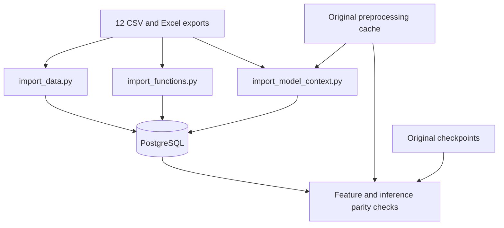
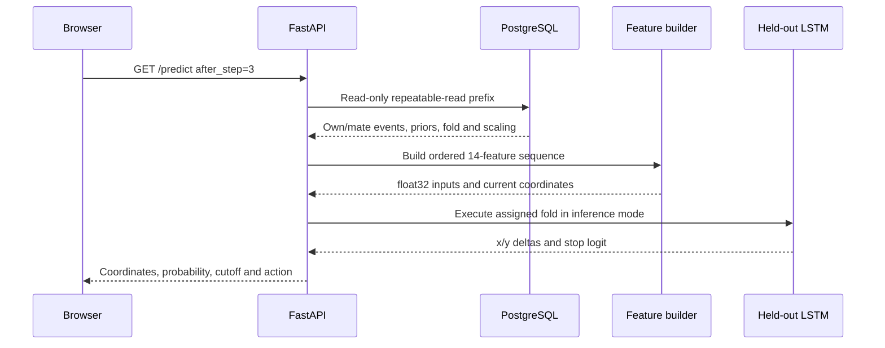

# Decision Lab engineering guide

by Kaan Mutlu

Source reviewed: `d0afd0c367f72354259d0661a76a0119fb4ed8b2`, as identified by the uploaded Git archive. This guide explains code in that exact snapshot. It is not a claim about every current AWS setting or a fresh run of the private model.

## 1. Start with the purpose

The experimental game asks people to search an unknown one-dimensional objective under competition and limited testing resources. A sample selects x and reveals y at a cost. Information-sharing conditions determine whether a player sees a teammate's x/y and an opponent's scores. The app replays those decisions and compares the original held-out LSTM's next-action predictions with the recorded behavior.

The project demonstrates converting research into a usable service: validating files, organizing relational data, preserving model behavior during a feature-pipeline migration, serving inference and operating a containerized application. It is not a real-time recommendation policy, a streaming pipeline or a new training experiment.

## 2. Read the code in this order

1. `main.py`: HTTP entry points and the database reader.
2. `replay_story.py`: chronological sharing and final outcomes.
3. `sql_runtime.py`: the exact history selected for a prediction.
4. `feature_math.py`: what the model actually receives.
5. `verify_model.py` and `inference.py`: architecture, checkpoints and output interpretation.
6. `import_data.py`, `import_functions.py`, `import_model_context.py`: how records got into PostgreSQL.
7. `replay.html`: presentation state, matching predictions to revealed actions and chart geometry.
8. `compose.yaml`, `Dockerfile`, `deploy/`: runtime and host services.
9. `ci/` and verification scripts: which behavior is checked and with what evidence.

The [code index](CODE_INDEX.md) links every source file to its numbered listing, symbol index and line-by-line commentary.

## 3. Tool vocabulary

| Tool or concept | Its job in this project |
|---|---|
| Python | Runs importers, feature mathematics, inference and API handlers |
| SQL | Selects and joins records in PostgreSQL; not a separate machine-learning framework |
| PostgreSQL | Stores sessions, observations, objectives, context and fold assignments |
| pandas / NumPy | Turn SQL rows into grouped events and numerical feature arrays |
| PyTorch | Defines the LSTM architecture and executes loaded checkpoints on CPU |
| FastAPI | Maps URL requests to Python functions and validates query parameters |
| Uvicorn / ASGI | Runs the web application and handles incoming HTTP connections |
| HTML / CSS / JavaScript | Define the page, its appearance and browser behavior |
| SVG | Draws exact chart coordinates, markers, grid, star and error bracket |
| Docker image | Packaged application code and installed dependencies |
| Container | Running instance of an image |
| Docker Compose | Describes API, database, health checks, mounts and their network |
| Bind mount | Exposes an existing host folder such as models inside a container |
| Named volume | Keeps the PostgreSQL database across container replacement |
| Caddy | Host service terminating public HTTPS and forwarding to loopback port 8000 |
| Duck DNS | Keeps the hostname pointed at the server's changing public address |
| systemd | Starts/schedules installed Linux services, including the DNS update timer |
| GitHub Actions | Builds and tests commits; no AWS deployment step is present |
| ETL | Here, a finite batch import from exports through validation into SQL tables |
| Out-of-fold / held-out | Uses the saved model assigned to that sequence's original validation fold |
| Parity | Two implementations produce the same features/outputs within tolerance |

## 4. Three separate workflows

### Import and verification

`bootstrap_database.py` runs data, functions and model context in that order. Each importer has its own transaction and the same advisory-lock identifier. A failure rolls back that stage, not previously completed stages. Reruns skip identical records and reject conflicts.

### Live prediction

The sequence has all model-visible events through the selected own test. The neural network runs on each requested prefix; no recurrent hidden state is persisted across HTTP calls. The browser caches returned predictions for its current selection. The Python process caches checkpoints, not saved per-player predictions.

### Source changes to the live service

Git commit and push trigger CI. A reviewed merge updates GitHub `main`. An administrator fetches/merges on EC2 and rebuilds the API image/container. The PostgreSQL volume survives. Repository files under `deploy/` are configuration templates; editing them does not automatically update installed `/etc` or `/usr/local/bin` copies.

## 5. Database schema and keys

| Table | One row means | Key and relationships |
|---|---|---|
| experiment_sessions | One experimental session and its domain | PK session_id |
| participant_rounds | One nonempty player's round | Generated PK participant_round_id; FK session_id; unique session, participant, game, round |
| samples | One own test | Generated PK sample_id; FK participant_round_id; unique round ID plus step_number |
| round_functions | One shared round objective | PK session_id, game_number, round_number; FK session_id; parameters stored as JSONB |
| model_context | Model lineage/context for one player-round | PK/FK participant_round_id; original opponent export text; nullable fold 0..4; cache digest |

`group_id` and `opponent_group_id` are recorded grouping labels, not foreign keys to a teams table. A participant number must be interpreted with its session. Empty player-rounds are omitted, so a missing roster member cannot be inferred from these tables alone.

Two tuple conventions coexist:

- Raw importer insertion key: `(session, participant, game, round)`.
- Model key: `(session, game, round, participant)`.

Database code joins functions by session/game/round; there is no direct composite foreign key from participant_rounds to round_functions. Model context and objective rows must be imported before prediction.

Samples use `TIMESTAMP WITHOUT TIME ZONE`. Runtime string conversion preserves the original whole-second convention rather than establishing a universal timezone. Same-second own/teammate order is a deliberate modeling convention.

## 6. What the model can see

| Game | Own x/y | Teammate x/y | Opponent scores | Opponent x |
|---|---|---|---|---|
| 1 | Yes | No | No | No |
| 2 | Yes | Yes | No | No |
| 3 | Yes | No | Yes | No |
| 4 | Yes | Yes | Yes | No |

`sql_runtime.load_prefix` first finds the requested own sample timestamp. Own events require both step_number <= after_step and timestamp <= cutoff. Teammate events require timestamp < cutoff, only in games 2/4. This excludes a same-second teammate observation that would be ordered after the focal own event. Within the feature builder, events are sorted by `(timestamp, -is_own)`.

Opponent JSON retains its complete stored timeline. For each feature event, only opponent scores at/before that event are used. However, whether a timeline exists at all can affect the early competition-gap feature. This preserves original preprocessing and is not equivalent to proving all features were strictly available in a prospective live experiment.

Previous outcomes come from the latest earlier imported nonempty round for that participant within the same session/game. Current-round payoff and win are zero placeholders in the runtime query and never appear as current outcome features. Source timestamps do not establish an independent outcome-publication time.

## 7. The 14 features, in order

Let x_norm = (x - x_min)/(x_max - x_min), y_norm = y/estimated_maximum. Changes compare adjacent events in the merged visible stream, not necessarily adjacent own samples.

| Index | Feature | Meaning |
|---|---|---|
| 0 | delta_x | Change in normalized x |
| 1 | delta_fx | Change in normalized observed y |
| 2 | is_own | 1 for focal player, 0 for teammate |
| 3 | budget_frac | (200 - 10 × own samples so far)/200 |
| 4 | delta_comp_gap | Change in opponent best minus updated visible best |
| 5 | delta_distance_to_best_x | Change in x distance to updated visible best |
| 6 | delta_distance_to_best_y | Change in y distance to updated visible best |
| 7 | improvement | max(0, current normalized y - preceding visible best y) |
| 8 | delta_spread_x | Change in population standard deviation of own normalized x |
| 9 | delta_spread_y | Change in population standard deviation of own normalized y |
| 10 | stagnation_frac | Own non-improvement count × 10/200; any visible improvement resets it |
| 11 | time_frac | Elapsed since first merged event /120, clipped to [0,1] |
| 12 | prior_won | Previous available round's win flag, default 0 |
| 13 | prior_payoff_frac | Previous available round's payoff /200, default 0 |

Important consequences:

- The model sees x/y changes plus sequence history; absolute current x/y are also retained separately for reconstructing its outputs.
- A teammate can improve the visible best without spending the focal player's budget or contributing to own spread.
- Competition gap may be negative when the focal visible best leads. It is not clipped at zero.
- `/samples` and the UI's own-best ring use own best; feature_math uses the shared visible best in team-sharing games.
- The time feature is elapsed history, not a true remaining-time measurement. The display clock uses a different origin.
- Normalizing y by a full known objective maximum introduces analyst information. A new-player system would need to explicitly justify access to that scaling or redesign/retrain.

### Hand-worked prefix example

For a no-sharing round with domain [0,100] and estimated maximum 100, suppose the player samples (25,40) and then (50,60), eight seconds later. Assume no previous-round outcomes. This is an illustrative input, not an extracted research record.

First vector:
`[0, 0, 1, .95, 0, 0, 0, .40, 0, 0, 0, 0, 0, 0]`

Second vector:
`[.25, .20, 1, .90, 0, 0, 0, .20, .125, .10, 0, 8/120, 0, 0]`

After the second test the player has spent 20 tokens, improved their best and expanded their own sampled spread. If the predicted x delta at that event were .08, the absolute predicted x would be .50 + .08 = .58, or raw x = 58.

## 8. Network and outputs

`DeltaLSTM` is defined in `verify_model.py` and imported by `inference.py`. It applies LayerNorm across the 14 features, a single unidirectional LSTM with hidden width 64, and dropout 0.4 followed by three heads. Each head uses a hidden 32-unit ReLU layer. x/y heads end in tanh and predict bounded deltas, not bounded absolute coordinates. The stopping head returns a logit.

A request tensor has shape `[1, T, 14]`. Sequence packing supports variable lengths; runtime sends one prefix at a time. Evaluation mode disables dropout; inference_mode disables gradient bookkeeping. The last event's outputs are used. The assigned checkpoint is selected by zero-based saved fold; the API displays fold+1.

- Predicted normalized x = current normalized x + predicted delta_x.
- Auxiliary predicted normalized y = current normalized y + predicted delta_y.
- Stop probability score = sigmoid(stop logit).
- Predicted action = STOP when score >= saved game threshold, else CONTINUE.

No threshold search, optimizer, loss calculation or model fitting occurs in production. Weight/result hashes are checked before unpickling. A digest establishes byte identity against a trusted reference, not scientific validity. The general verification loaders still trust their pickle inputs.

The auxiliary y head remains available in the API but is not used to place the model on the chart. The chart uses a vertical x line, so it needs no synthetic or predicted y. An absolute x prediction may fall outside [0,1]; the API flags it, the UI preserves its numeric value and omits the off-chart line/bracket.

## 9. API contract

All project endpoints are GET requests. Query validation requires a listed session, game 1..4 and positive player/round/step values where applicable.

| Route | Required query | Result and caller |
|---|---|---|
| / | None | Serves replay.html to browser |
| /health | None | SELECT 1 connectivity; Docker health check |
| /sessions | None | Dates/domains/counts; browser startup |
| /rounds | session_id, game_number | Player-round choices and own counts; browser selectors |
| /samples | session_id, game_number, participant_id, round_number | Ordered own history, optional through_step; older UI/verification clients |
| /landscape | session_id, game_number, round_number | Full curve and normalization; optional points (50..2000) |
| /predict | session_id, game_number, participant_id, round_number, after_step | Historical fold prediction, stopping threshold/action and metadata |
| /replay-story | session_id, game_number, participant_id, round_number | Full permitted own/mate timeline plus per-event rival best |
| /replay-results | session_id, game_number, participant_id, round_number | Both teams, player budgets, recorded payoff/win and completeness |
| /docs, /redoc, /openapi.json | None | Default FastAPI documentation/schema routes |

An excluded round returns HTTP 200 with available:false for prediction. Nonexistent records produce 404, bad query/step values produce 422, selected consistency failures produce 409 and database/missing-artifact failures produce 503. These are the explicit handled cases, not a guarantee every possible bug avoids HTTP 500.

There is no authentication or new-player submission endpoint in the snapshot. Full historical story/results and landscape are accessible by URL regardless of the browser's reveal controls. The UI reveal boundary is explanatory, not a security boundary.

## 10. Browser state and chart

`replay.html` contains the page, CSS and JavaScript in one file. Later CSS overrides earlier styles. Some hidden panels/old selectors remain from iterative development; they are explained in the annotated guide rather than silently removed.

| State | Meaning |
|---|---|
| rows | Available player-round menu entries |
| story | Complete permitted timeline for the selected player-round |
| shown | Number of merged events currently revealed |
| version / AbortController | Invalidate requests from an older selection |
| predictionGeneration / resultGeneration | Invalidate older asynchronous work within a selection |
| predictions | Cache keyed by after_step, cleared on selection changes |
| predictionKey | Current version/frame request identity; prevents render/request loops |
| current | Matching displayed prediction or null |
| curve | Cached revealed landscape |
| resultsCache | Final results available for reopening the dialog |
| timer | One-second merged-event playback interval |

When own test 4 is revealed, the browser requests after_step=3. The server builds inputs only through test 3, even though the browser already has the whole historical story. The returned prediction and actual fourth x are displayed together. At the next own test, it requests the corresponding previous prefix. Teammate frames do not create a new own-step forecast, although a cache lookup/render may recur.

The final stop comparison instead uses the final own prefix and appears inside results when model comparison is enabled. A round with three own tests can have this final stop display even though no fourth x comparison exists.

Error in percentage points = `100 * abs(predicted_position_fraction - actual_position_fraction)`. This is a horizontal distance, not a confidence interval. It is not divided by actual x. On a [-20,20] domain, raw predicted x=4 and actual x=0 differ by 4/40×100 = 10 pp.

Chart geometry uses a 900×580 viewBox. Plot x is 76..866; plot y is 110..450. The star annotation is at y55, prediction annotation at y85, error text at y503, error bracket at y518 and x title at y560. SVG y increases downward. The star is the highest point in the fetched 1000-point curve, while normalization uses the denser stored maximum estimate; neither should be called a guaranteed exact optimum.

## 11. Artifact lifecycle and side effects

| File/stage | Reads | Writes |
|---|---|---|
| setup_docker.py | Local source/private-file existence and ignore rules | Creates/appends .env when needed |
| import_data.py | 12 raw files; existing SQL records | Sessions, player-rounds and samples in one transaction |
| import_functions.py | Raw coefficients and SQL session metadata | Function rows in one transaction |
| import_model_context.py | Raw opponent exports, original cache/fold_map | Model context rows in one transaction |
| bootstrap_database.py | PG environment and importer code | Launches the three independent write stages |
| main / replay_story | Historical SQL records | HTTP responses only |
| sql_runtime / feature_math | Prefix rows and metadata | In-memory features only |
| inference.py | Weights and results pickles, SQL-built inputs | Process-local model cache and JSON outputs |
| verify_model.py | Three trusted original artifacts | Console results only |
| verify_sql_features.py | Database and private reference artifacts | Console results only |
| verify_sql_runtime.py | Database and private reference artifacts | Console results only |
| ci/smoke_test.py | Schemas and disposable connection settings | Synthetic CI database records; HTTP assertions |
| DNS updater | Protected token file and network | External DNS update and generic success/failure output |

## 12. Validation without overclaiming

| Mechanism | Coverage | Does not establish |
|---|---|---|
| verify_model.py | All cached output arrays in saved fold/sequence order; selected prefix endpoints; 1e-5 output tolerance | New generalization, original fold independence, calibrated stopping |
| verify_sql_features.py | Every cached sequence/key/fold, features/current coords to 1e-6 and network outputs to 1e-5 | Prospective availability of analyst normalization or original context convention |
| verify_sql_runtime.py | First/fourth/final own prefixes for the first sequence in each session/game; typically 36 here | Every possible request prefix or every edge case |
| GitHub CI | Image/dependency checks plus five synthetic HTTP tests | Real weights, /predict, competition routes, JavaScript rendering or AWS deployment |
| Docker /health | API reachability and SELECT 1 | Complete schema, checkpoint loading, model accuracy, load capacity |

Previously reported counts are 1,093 imported nonempty rounds and 1,086 model sequences, with 9,101 next-position/value targets and 10,187 stopping targets. They are not remeasured from this source-only ZIP. The newly deployed competition routes were checked separately with verify_replay.py from the update package, but that file is absent from this repository archive.

The reported 10.40 pp MAE in verify_model applies where own_index >=3. own_index is zero-based at the forecast origin, so this means forecasts after at least four own tests. The UI reveals its first comparison at test 4 from an after_step=3 prefix. An accuracy claim for the exact UI subset requires matching those cutoffs explicitly.

The preserved five-fold map is essential to reproducibility. The source archive contains no original training/splitting implementation, so it cannot by itself demonstrate that participants, teammates and opponents were grouped correctly during training. Do not replace that missing evidence with a claim of random folds or completely unseen participants.

## 13. Setup and operations

For the already working deployment, this documentation requires no database import or API rebuild.

For a fresh authorized local copy, place the 12 files under data/raw and the three original .pkl artifacts under models. Activate the intended Python environment, then run setup_docker.py, validate Compose, build the image, initialize the tools service, run private parity checks and finally start api. Use [DOCKER_SETUP.md](../DOCKER_SETUP.md) for the exact existing commands. Importing data is unnecessary when only the page or documentation changes.

Inside Compose, PGHOST=db resolves the database service. Python's direct-run default localhost instead targets the host PostgreSQL installation. The API container listens on 0.0.0.0:8000 but is published only at host 127.0.0.1:8000. Caddy runs on the host and reaches that mapping. PostgreSQL has no host-published port.

Container Linux user appuser/UID10001 and database role postgres are different identities. Read-only SQL transactions and read-only mounts do not mean a least-privilege database role has been configured: the application still connects as postgres. File permissions/ACLs must allow UID10001 to read model mounts.

The DNS script references /etc/decision-lab/duckdns-token rather than storing a token in source. systemd runs the installed updater once after boot and periodically afterward. A Git pull changes templates; it does not reload Caddy or reinstall those units. Host security groups, installed services, token contents and actual startup enablement are outside this archive.

For a code deployment, preserve server-local configuration, fast-forward the reviewed branch and rebuild api. To pause the whole website, stop the EC2 instance through its console; do not delete the database volume. Hosting-credit and billing terms are outside this code guide. See [deploy/README.md](../deploy/README.md) for the established operations notes.

## 14. What to say in an interview

“I turned a behavioral research model into a deployed historical inference application. I imported validated records into PostgreSQL, rebuilt the original sequence features from SQL-selected prefixes, preserved saved held-out assignments, verified output parity and served the model through FastAPI on AWS using Docker. The replay lets viewers inspect information-sharing conditions and matched next-action predictions. CI checks container/API integration with synthetic data. The project demonstrates deployment and reproducibility; it does not yet provide a validated decision-support policy or automated retraining.”

For the separate 311 project, reusable lessons are batch ingestion, SQL data contracts, baseline comparisons, API packaging, CI and cloud operation. Its changing outcomes and operational forecasts will require a new data/model evaluation design, not reuse of this game's fold map.
